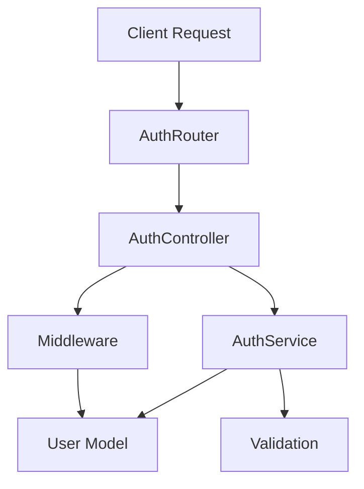

# Authentication Module Architecture

## Overview

JWT-based authentication system for the chatroom application with user registration, login, and protected routes.

**Key Features:**
- User registration/login with bcrypt password hashing
- JWT token authentication
- Protected route middleware
- Input validation and error handling

## Architecture

Layered architecture with clear separation of concerns:



## Components

### AuthRouter
- Defines API routes (`/register`, `/login`, `/profile`, etc.)
- Applies authentication middleware to protected routes

### AuthController  
- Handles HTTP requests/responses
- Input validation and error formatting
- Methods: `register()`, `login()`, `getProfile()`, `updatePassword()`

### AuthService
- Core authentication logic
- JWT token generation/validation
- User creation and retrieval
- Password management

### Middleware
- `authenticate`: Required auth for protected routes
- `optionalAuth`: Optional auth middleware  
- Extracts JWT from headers and attaches user to request

### Validation
- `validateEmail()`, `validateUsername()`, `validatePassword()`
- Input sanitization and format checking

## API Endpoints

- `POST /auth/register` - User registration
- `POST /auth/login` - User login  
- `GET /auth/profile` - Get user profile (protected)
- `PUT /auth/password` - Update password (protected)
- `POST /auth/validate` - Validate JWT token

**Auth Response Format:**
```typescript
{
  token: string;
  user: {
    id: string;
    username: string;
    email?: string;
    createdAt: Date;
  };
}
```

## Configuration

Required environment variables:
```bash
JWT_SECRET=your-secret-key
JWT_EXPIRES_IN=7d
MONGODB_URI=mongodb://localhost:27017/chatroom
```
